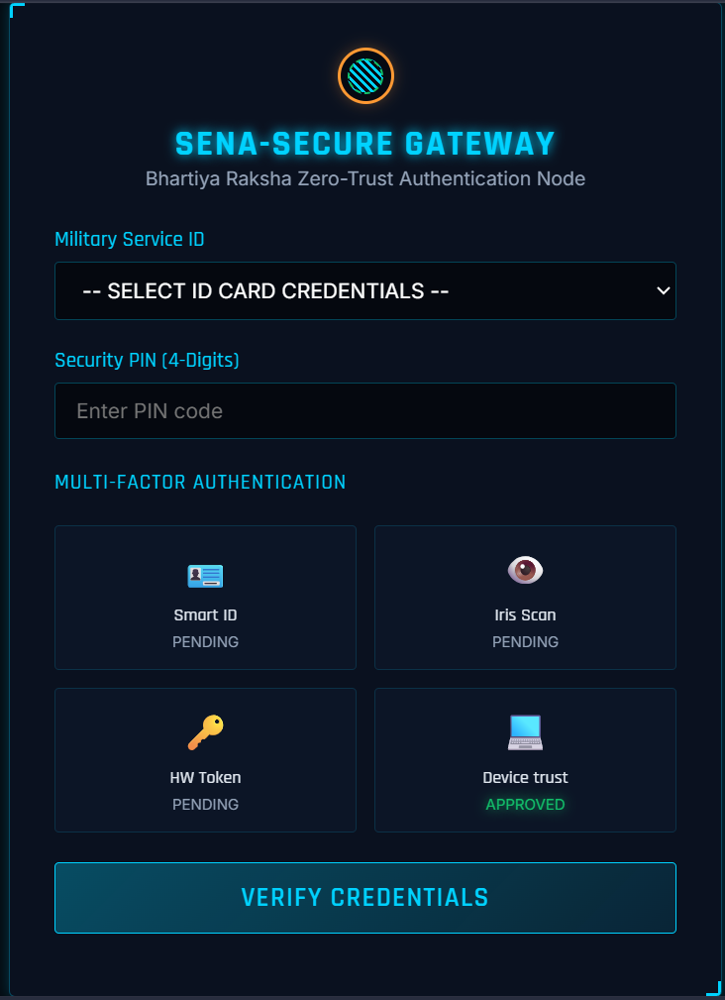

# Sena-Secure 🛡️
### Classified Secure Information Exchange & Command Platform



Sena-Secure is an immersive, zero-trust military communications and secure repository exchange portal customized for tactical defense operations. It simulates modern post-quantum cryptography, real-time threat monitoring (SIEM/IDS), and command node coordination.

---

## 🚀 Key Features

* **Zero-Trust Multi-Factor Authentication**: Implements multi-stage validation checks including Military Service ID, Security PIN, Smart Card token verification, Iris/Biometric scanning, and Hardware security tokens.
* **Post-Quantum Cryptography (PQC) Simulator**:
  * **CRYSTALS-Kyber-768**: Simulated dual-layer Key Encapsulation Mechanism (KEM) to securely exchange symmetric keys over low-bandwidth tactical VHF mesh and satellite networks.
  * **CRYSTALS-Dilithium-3**: Simulates PQC signature creation and integrity checks on files stored locally or transmitted across nodes.
* **Transparent Cryptographic Fallback Engine**: Employs pure JavaScript PBKDF2 key derivation and XOR stream cipher fallback algorithms when accessing via insecure contexts (like `file:///` protocols or non-localhost local IPs) where native browser `window.crypto.subtle` is unavailable.
* **Interactive Canvas Tactical Map**: Vector rendering of border sectors and active command posts. Supports manual node containment and path isolation directly from the command panel.
* **Real-time Threat Monitoring (SIEM/IDS)**: Simulated WebSocket server feeds logs, Suricata IDS traffic analysis, and DEFCON Defenses directly to the network monitor dashboard.
* **Immutable System Audit Ledger**: Role-based access logs tracking login successes, packet transmissions, and node isolations.

---

## 🛠️ Tech Stack

* **Backend**: Node.js, Express, WebSocket (`ws` module)
* **Frontend**: HTML5, Vanilla CSS, Vanilla JavaScript
* **Audio Engine**: Web Audio API Oscillators (synthesizing retro radar hums, transmission alerts, key clicks, and defcon alarms)

---

## 📥 Installation & Setup

1. **Clone the repository**:
   ```bash
   git clone https://github.com/ananTripathi-future/sena-secure.git
   cd sena-secure
   ```

2. **Install dependencies**:
   ```bash
   npm install
   ```

3. **Start the server**:
   ```bash
   node server.js
   ```

4. **Access the terminal**:
   Open your browser and navigate to:
   👉 **http://localhost:3000**

---

## 🔑 Operational Credentials (PINs)

Use these credentials to test different system clearances and Role-Based Access Control (RBAC/ABAC) behaviors:

| Name | Role | ID Card | Security PIN | Clearance Level |
| :--- | :--- | :--- | :--- | :--- |
| **Gen. R. K. Singh** | Commander | `SENA-CDR-01` | **`1122`** | L5 - Full Operational Command |
| **Col. Neha Sharma** | Intelligence Officer | `SENA-INT-05` | **`3344`** | L4 - Secret Clearance |
| **Maj. Vikramaditya** | Field Operator | `SENA-FLD-12` | **`5566`** | L3 - Confidential Clearance |
| **Wng Cmdr S. Patel** | System Admin | `SENA-ADM-99` | **`9900`** | L5 - System Clearance |
| **Dr. A. P. Subramanian** | Auditor | `SENA-AUD-02` | **`7788`** | L4 - Audit Clearance |

*(Make sure to click each Multi-Factor Authentication checkmark (Smart ID, Iris Scan, HW Token) on the screen to verify them before submitting your credentials!)*

---

## 📡 Tactical Network Settings (Bandwidth Simulator)
The chat system includes a channel selector to simulate real-world transmission environments:
1. **Fiber (100 Mbps)**: Immediate message relay with zero packet drops.
2. **Satellite GSAT (256 Kbps)**: Adds network latency (approx. 800ms).
3. **Tactical VHF Mesh (9.6 Kbps)**: High latency (2500ms) simulating high packet loss resilient HF/VHF radio frequencies.
4. **Blackout / Offline**: Automatically routes messages to an **Offline Queue outbox**. Messages are cached locally and synchronized instantly once a connection is restored.
