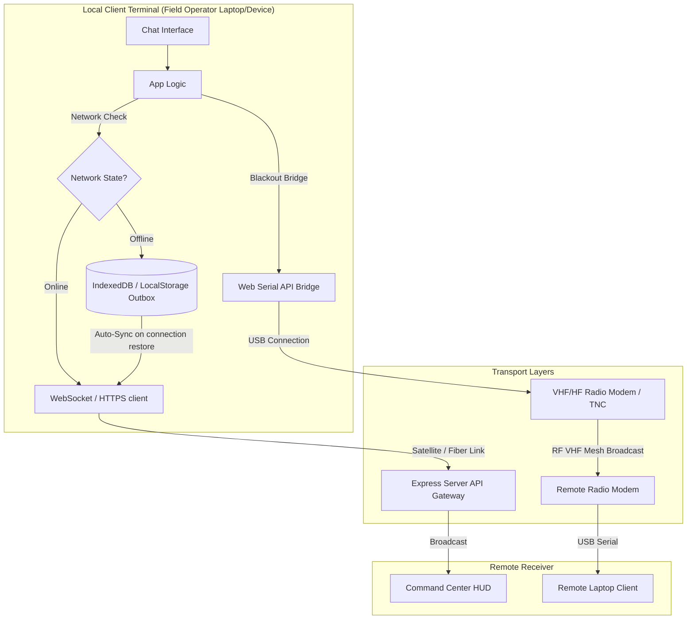

# Tactical Offline Sync & Low-Bandwidth Guide
## Implementation in Modern Web Projects

In remote or mountainous areas (like Leh, Ladakh, or border posts), cellular and standard internet networks are often degraded, highly latent, or completely offline. To ensure messages and commands reach the recipient, you must design your web application with an **offline-first store-and-forward architecture**, combined with **low-bandwidth transport bridges**.

Below is the conceptual architecture, followed by step-by-step modules you can integrate into your project.

---

## 1. System Architecture



---

## 2. Module 1: The Offline Outbox Queue (Client-Side JS)

Use this module to automatically trap outgoing messages when the network is down, store them locally, detect when the connection recovers, and stream the queue to the backend.

Save this as `transceiver.js` or integrate it into your frontend code:

```javascript
/**
 * Tactical Offline Outbox Transceiver
 * Manages local storage queuing, network state detection, and synchronization.
 */
class TacticalTransceiver {
  constructor(apiEndpoint, apiToken) {
    this.apiEndpoint = apiEndpoint;
    this.apiToken = apiToken;
    this.outboxKey = 'sena_tactical_outbox';
    this.isOnline = navigator.onLine;
    this.isSyncing = false;

    this.initNetworkListeners();
  }

  // 1. Initialize browser network listeners
  initNetworkListeners() {
    window.addEventListener('online', () => this.handleNetworkChange(true));
    window.addEventListener('offline', () => this.handleNetworkChange(false));
    
    // Periodic heartbeat ping to verify active gateway routing (navigator.onLine can lie)
    setInterval(() => this.verifyGatewayConnectivity(), 10000);
  }

  async handleNetworkChange(onlineState) {
    this.isOnline = onlineState;
    console.log(`[Transceiver] System network report: ${onlineState ? 'ONLINE' : 'OFFLINE'}`);
    
    if (onlineState) {
      this.triggerStatusUI('ONLINE', '#00ff66');
      await this.syncOutbox();
    } else {
      this.triggerStatusUI('OFFLINE (OUTBOX ENGAGED)', '#ff3333');
    }
  }

  // Perform active ping checks to the Gateway server
  async verifyGatewayConnectivity() {
    if (!navigator.onLine) {
      if (this.isOnline) this.handleNetworkChange(false);
      return;
    }
    try {
      const response = await fetch('/api/ping', { method: 'HEAD', cache: 'no-store' });
      const wasOffline = !this.isOnline;
      this.isOnline = response.ok;
      
      if (this.isOnline && wasOffline) {
        this.handleNetworkChange(true);
      }
    } catch (e) {
      if (this.isOnline) {
        this.handleNetworkChange(false);
      }
    }
  }

  // 2. Queue Message to Local Storage
  queueMessage(recipient, encryptedContent, metadata = {}) {
    const queue = this.getOutbox();
    const packet = {
      uuid: crypto.randomUUID ? crypto.randomUUID() : Math.random().toString(36).substring(2, 15),
      timestamp: new Date().toISOString(),
      recipient,
      content: encryptedContent,
      metadata
    };

    queue.push(packet);
    localStorage.setItem(this.outboxKey, JSON.stringify(queue));
    console.log(`[Transceiver] Packet queued in outbox. Queue size: ${queue.length}`);
    this.updateBufferUI(queue.length);
    
    // Play a low-warning click sound for queuing if initialized
    if (window.SenaAudio) window.SenaAudio.playFailure();
    return packet;
  }

  getOutbox() {
    const raw = localStorage.getItem(this.outboxKey);
    return raw ? JSON.parse(raw) : [];
  }

  // 3. Synchronize local outbox queue to remote server
  async syncOutbox() {
    if (this.isSyncing) return;
    const queue = this.getOutbox();
    if (queue.length === 0) return;

    this.isSyncing = true;
    console.log(`[Transceiver] Syncing ${queue.length} packets to gateway...`);
    this.triggerStatusUI(`SYNCING BACKLOG (${queue.length})`, '#ffaa00');

    while (queue.length > 0) {
      const packet = queue[0];
      try {
        const response = await fetch(this.apiEndpoint, {
          method: 'POST',
          headers: {
            'Content-Type': 'application/json',
            'Authorization': this.apiToken
          },
          body: JSON.stringify(packet)
        });

        if (response.ok) {
          queue.shift(); // Remove successfully sent packet
          localStorage.setItem(this.outboxKey, JSON.stringify(queue));
          this.updateBufferUI(queue.length);
        } else {
          // Sever error (e.g. invalid token, validation issue), drop or hold
          console.error('[Transceiver] Server rejected packet:', response.statusText);
          break;
        }
      } catch (err) {
        console.warn('[Transceiver] Transmission link dropped during sync. Postponing sync.', err);
        break; 
      }
    }

    this.isSyncing = false;
    
    if (queue.length === 0) {
      this.triggerStatusUI('SYNCHRONIZED', '#00ff66');
      if (window.SenaAudio) window.SenaAudio.playSuccess();
    } else {
      this.triggerStatusUI(`DEGRADED LINK (${queue.length} left)`, '#ffaa00');
    }
  }

  // UI Helpers (adjust selector targets to match your app IDs)
  triggerStatusUI(status, color) {
    const el = document.getElementById('transceiver-signal');
    if (el) {
      el.innerText = status;
      el.style.color = color;
    }
  }

  updateBufferUI(count) {
    const el = document.getElementById('transceiver-buffer-count');
    if (el) {
      el.innerText = count > 0 ? `${count} pending packets` : '0 pending packets';
      el.style.color = count > 0 ? '#ffaa00' : '#00d2ff';
    }
  }
}
```

---

## 3. Module 2: Resilient WebSocket Reconnect

WebSockets are ideal for real-time traffic updates. However, they disconnect frequently in mountainous terrains. Integrate this exponential-backoff connection manager:

```javascript
class ResilientWebSocket {
  constructor(url, onMessageCallback) {
    this.url = url;
    this.onMessage = onMessageCallback;
    this.ws = null;
    this.reconnectAttempts = 0;
    this.maxDelay = 30000; // max delay 30s
    this.connect();
  }

  connect() {
    console.log('[Socket] Establishing connection...');
    this.ws = new WebSocket(this.url);

    this.ws.onopen = () => {
      console.log('[Socket] Secure channel opened.');
      this.reconnectAttempts = 0; // reset retry counter
      this.updateUI(true);
    };

    this.ws.onmessage = (event) => {
      try {
        const data = JSON.parse(event.data);
        this.onMessage(data);
      } catch (e) {
        console.error('[Socket] Failed to parse websocket frame', e);
      }
    };

    this.ws.onclose = (event) => {
      console.warn('[Socket] Connection terminated.', event.reason);
      this.updateUI(false);
      this.scheduleReconnect();
    };

    this.ws.onerror = (err) => {
      console.error('[Socket] Connection error occurred.', err);
      this.ws.close();
    };
  }

  scheduleReconnect() {
    this.reconnectAttempts++;
    // Exponential backoff with jitter: 2^attempts * 1000ms + random offset
    const delay = Math.min(
      Math.pow(2, this.reconnectAttempts) * 1000 + Math.random() * 1000, 
      this.maxDelay
    );
    
    console.log(`[Socket] Retrying in ${(delay / 1000).toFixed(1)} seconds...`);
    setTimeout(() => this.connect(), delay);
  }

  send(data) {
    if (this.ws && this.ws.readyState === WebSocket.OPEN) {
      this.ws.send(JSON.stringify(data));
      return true;
    }
    return false; // Queue or handle locally if socket is closed
  }

  updateUI(isConnected) {
    const el = document.getElementById('ws-connections');
    if (el) {
      el.innerText = isConnected ? "CONNECTED" : "DISCONNECTED (AUTO-RECONNECT)";
      el.style.color = isConnected ? '#00ff66' : '#ff3333';
    }
  }
}
```

---

## 4. Module 3: Tactical Web Serial Bridge (Zero Internet Mode)

> [!NOTE]
> **What is the Web Serial API?**
> If operators are in a complete blackout area with no internet, they connect their laptops directly to standard military tactical radios (like VHF/UHF systems or a Terminal Node Controller - TNC) via USB/Serial COM port. The browser can communicate directly with this hardware using the Web Serial API.

Here is how you implement a button on your web app that transmits text payloads directly over radio frequencies:

```javascript
class TacticalRadioBridge {
  constructor() {
    this.port = null;
    this.writer = null;
    this.reader = null;
    this.encoder = new TextEncoder();
    this.decoder = new TextDecoder();
  }

  // 1. Prompt operator to select the connected Radio USB Modem COM Port
  async requestPort() {
    try {
      this.port = await navigator.serial.requestPort();
      // Open port at 9600 baud rate (common for low-bandwidth tactical modems)
      await this.port.open({ baudRate: 9600 });
      this.writer = this.port.writable.getWriter();
      this.startReading();
      console.log("[Radio Bridge] COM Port open & listening.");
      return true;
    } catch (e) {
      console.error("[Radio Bridge] Selection failed:", e);
      return false;
    }
  }

  // 2. Send the message payload over Radio Serial
  async transmitOverRadio(encryptedText) {
    if (!this.writer) {
      alert("Error: Radio hardware interface is not connected. Connect serial COM device.");
      return;
    }

    try {
      // Structure package as standard KISS/NMEA frame or basic transmission line
      // Standard framing prefixes (e.g. STX - Start of Text, ETX - End of Text) help low-end radios identify boundaries
      const framedPayload = `\x02${encryptedText}\x03\n`;
      const data = this.encoder.encode(framedPayload);
      
      await this.writer.write(data);
      console.log("[Radio Bridge] Bytes pushed to transmitter hardware buffer.");
    } catch (e) {
      console.error("[Radio Bridge] Write failed:", e);
    }
  }

  // 3. Continuously listen for incoming messages received over the Radio static link
  async startReading() {
    while (this.port.readable) {
      this.reader = this.port.readable.getReader();
      try {
        let buffer = "";
        while (true) {
          const { value, done } = await this.reader.read();
          if (done) break;
          
          const text = this.decoder.decode(value);
          buffer += text;
          
          // Identify complete message packets separated by newline or ETX (\x03)
          if (buffer.includes("\n") || buffer.includes("\x03")) {
            this.processReceivedRadioPacket(buffer);
            buffer = "";
          }
        }
      } catch (err) {
        console.error("[Radio Bridge] Read loop crashed:", err);
      } finally {
        this.reader.releaseLock();
      }
    }
  }

  processReceivedRadioPacket(packet) {
    // Strip STX/ETX wrapper characters
    const cleanPacket = packet.replace(/[\x02\x03\n]/g, "");
    console.log("[Radio Bridge] Packet received from VHF:", cleanPacket);
    
    // Dispatch to your chat app interface
    if (window.handleIncomingRadioMessage) {
      window.handleIncomingRadioMessage(cleanPacket);
    }
  }

  async close() {
    if (this.writer) {
      await this.writer.close();
      this.writer.releaseLock();
    }
    if (this.reader) {
      await this.reader.cancel();
      this.reader.releaseLock();
    }
    if (this.port) {
      await this.port.close();
    }
  }
}
```

---

## 5. Module 4: Server-Side Sync API Endpoint (Node.js/Express)

Add this endpoint to your `server.js` backend to receive queued messages and ensure duplicates are ignored (e.g. if the client successfully sent a message but the acknowledgement dropped, they might send it again).

```javascript
// Database storing successfully delivered message UUIDs to prevent double delivery
const deliveredMessageUUIDs = new Set();

app.post('/api/messages', (req, res) => {
  const token = req.headers['authorization'];
  if (!token) return res.status(401).json({ success: false, message: "Session token required" });

  try {
    const payload = JSON.parse(Buffer.from(token, 'base64').toString('ascii'));
    const { recipient, content, encrypted, algorithm, clearance, uuid } = req.body;

    // Deduplication check
    if (uuid && deliveredMessageUUIDs.has(uuid)) {
      console.log(`[Deduplication] Message with UUID ${uuid} already saved. Ignoring duplicate.`);
      return res.status(200).json({ success: true, cached: true });
    }

    const newMessage = {
      id: messages.length + 1,
      uuid: uuid || Date.now().toString(), // fallback
      sender: `${payload.role} (${payload.militaryId})`,
      recipient,
      timestamp: new Date().toISOString(),
      content,
      encrypted: !!encrypted,
      algorithm: algorithm || "AES-256-GCM",
      clearance: clearance || "L3 - Confidential"
    };

    messages.push(newMessage);
    if (uuid) deliveredMessageUUIDs.add(uuid); // record uuid

    // Broadcast to online users via WebSockets
    broadcastToWS({ type: "NEW_MESSAGE", message: newMessage });

    res.status(201).json(newMessage);
  } catch (err) {
    res.status(400).json({ success: false, message: "Invalid payload formatting." });
  }
});
```

---

## 6. How to Integrate and Test locally in your project

1. **Paste Module 1 (`TacticalTransceiver`)** inside your `public/js/app.js` (or in a separate frontend file `transceiver.js`).
2. **Replace the `sendSecureMessage` function** in your current `app.js` with the transceiver queue trigger:
   ```javascript
   // Instantiate Transceiver globally
   const transceiver = new TacticalTransceiver('/api/messages', state.authToken);

   // In your sendMessage function:
   if (!transceiver.isOnline) {
      // Offline queue logic
      transceiver.queueMessage(recipient, encryptedPayload, { algo: algorithmName });
      // update your UI to show it is queued in outbox
   } else {
      // Normal direct HTTPS/WS call
      await fetch('/api/messages', { ... });
   }
   ```
3. **Add the Deduplication Check on your backend API** (`server.js`) so that duplicate requests from noisy radios/satellites do not pollute the chat logs.
4. **Test the Simulation**:
   - Change your Transceiver profile to **Offline (Blackout)**.
   - Type and send three messages in the terminal chat. They will print on screen as `[QUEUED IN OUTBOX]` with a yellow border.
   - Now switch the transceiver link back to **Broadband** or **Satellite**.
   - You will see the outbox counter start to decrement, the transceiver status will show `SYNCING`, and the packets will be delivered sequentially to the main chat room and server database!
